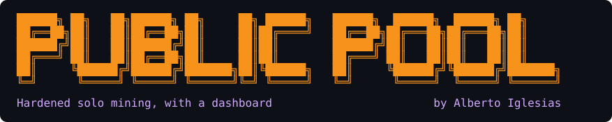

<p align="center">
  
</p>

[](https://github.com/docked-titan-foundation/public-pool/actions/workflows/pipeline.yml)

[](#-verifying-the-image)
[](https://github.com/docked-titan-foundation/public-pool/pkgs/container/public-pool)
[](https://renovatebot.com)
[](https://www.gnu.org/licenses/gpl-3.0)


**A hardened, signed container image for [Public Pool](https://github.com/benjamin-wilson/public-pool) — the solo Bitcoin mining stratum server with a web dashboard, used by Bitaxe, NerdQAxe and similar miners.**
Built from a pinned upstream commit, run non-root, and cosign-signed with an SBOM — because in solo mining the pool decides who a found block pays.

> [!NOTE]
> **Status: beta (`1.0.0-beta`).** The image is built, signed, and tested end to
> end against a real regtest node on every release. Tags may still change before
> `1.0.0` — pin a specific version (or a digest) and read the
> [changelog](CHANGELOG.md) before upgrading. Issues and feedback are welcome.

---

## Contents

- [What is this?](#-what-is-this)
- [Try it in 5 minutes (no real node)](#-try-it-in-5-minutes-no-real-node)
- [Prerequisites](#-prerequisites)
- [Usage](#-usage)
  - [Point a miner at it](#point-a-miner-at-it)
- [Configuration](#-configuration)
- [What this image does differently](#-what-this-image-does-differently)
- [What to expect from solo mining](#-what-to-expect-from-solo-mining)
- [Verifying the image](#-verifying-the-image)
- [Documentation](#-documentation)
- [Version matrix](#-version-matrix)
- [Development](#-development)
- [Credits](#-credits)
- [Community & contributing](#-community--contributing)
- [License](#-license)

---

## 📝 What is this?

A hardened container image for **Public Pool** — the open-source solo Bitcoin
mining stratum server with a built-in web dashboard, used by Bitaxe, NerdQAxe and
similar miners.

Public Pool bridges Stratum-speaking miners to a `bitcoind` that only speaks
`getblocktemplate`, and serves a small HTTP API/dashboard so you can watch your
miners and shares. In solo mining each miner authenticates with the Bitcoin
address it wants a found block to pay, set as its stratum username. There is no
operator, no cut, and no shared payout.

> **Why a hardened image matters.** In solo mining, the pool builds the block
> template's coinbase output — the transaction that pays out a found block.
> Whatever image you run decides where that money goes. Upstream publishes **no
> releases and no official image**, and its own Dockerfile runs the process as
> `root` and ships the full build tree (source and devDependencies) into the final
> image. This one is built in public CI from a pinned upstream commit, runs
> non-root, ships only production code, and is cosign-signed with an SBOM and SLSA
> provenance — so you can verify exactly what you are running.

<details>
<summary><b>New to this? A 20-second glossary</b></summary>

| Term | In one line |
|---|---|
| **Stratum** | The TCP protocol a miner (e.g. a Bitaxe) speaks to a pool. Public Pool is a stratum *server*. |
| **Solo mining** | You mine to *your own* node. Find a block and the whole reward is yours — but blocks are rare (see below). |
| **`getblocktemplate` (RPC)** | How the pool asks bitcoind "what should I mine on?". Miners can't speak this; the pool translates. |
| **Coinbase** | The first transaction in a block — the one that pays the reward. In solo mode it pays the miner's username address. |
| **ZMQ** | A fast side-channel bitcoind uses to tell the pool "a new block just landed," so it doesn't have to poll. |
| **Dashboard / API** | Public Pool's HTTP surface (port 3334) — your miners, hashrate and shares at a glance. |

</details>

## 🏁 Try it in 5 minutes (no real node)

You don't need a synced mainnet node to see this work. The integration test builds
the image, boots a throwaway `bitcoind -regtest` (a private, instant chain), points
Public Pool at it, and drives a miner through the **full path** — subscribe over
stratum, get a `mining.notify` job that the pool could only build from a real
`getblocktemplate`:

```bash
git clone https://github.com/docked-titan-foundation/public-pool.git
cd public-pool
mise install         # installs the pinned toolchain
mise run test        # builds the image, boots regtest + the pool, mines end to end
```

It finishes in seconds — regtest needs no chain sync. This is exactly what CI runs
on every release, so a green run here is the same green run that gates a publish.

## 📦 Prerequisites

| You need | Why |
|---|---|
| **Docker** (or any OCI runtime / Kubernetes) | To run the image. |
| A **`bitcoind`** reachable over RPC and ZMQ | The pool has no chain of its own; it builds work from the node's `getblocktemplate`. See requirements below. |
| A reachable **stratum address** (host port, or a LoadBalancer on Kubernetes) | Stratum is raw TCP — miners connect straight to it, not through an HTTP proxy. |
| A **Bitcoin address** you control | It goes on the miner as the username; a found block pays it. |

### Bitcoin node requirements

- **Not pruned.** The node must be able to serve full block templates.
- **Fully synced.** `getblocktemplate` refuses to serve while
  `initialblockdownload` is true, so the pool cannot hand out work until the chain
  has caught up.
- **ZMQ enabled** so the pool learns about new blocks immediately instead of
  polling:

  ```text
  zmqpubrawblock=tcp://0.0.0.0:28332
  zmqpubhashblock=tcp://0.0.0.0:28333
  ```

## 🚀 Usage

Public Pool is configured entirely through environment variables and keeps its
share store in a SQLite DB you should persist.

```bash
docker run -d --name public-pool \
  -p 3333:3333 \
  -p 3334:3334 \
  -e API_PORT=3334 \
  -e STRATUM_PORT=3333 \
  -e NETWORK=mainnet \
  -e BITCOIN_RPC_URL=http://your-bitcoin-node \
  -e BITCOIN_RPC_PORT=8332 \
  -e BITCOIN_RPC_USER=bitcoin \
  -e BITCOIN_RPC_PASSWORD=... \
  -e BITCOIN_RPC_TIMEOUT=10000 \
  -e BITCOIN_ZMQ_HOST=tcp://your-bitcoin-node:28332 \
  -v public-pool-db:/public-pool/DB \
  ghcr.io/docked-titan-foundation/public-pool:<version>   # pin a version, or a digest
```

> `API_PORT` is **mandatory** — Public Pool exits at startup if it is unset. Pin
> the image by `<version>` (see the [version matrix](#-version-matrix)) or by
> `@sha256:…` digest. Pinning is the same discipline this image applies to its own
> upstream source.

For **Kubernetes**, use the
[bitcoin-stack](https://github.com/docked-titan-foundation/bitcoin-stack) chart,
which wires the node and pool together and pins this image by digest.

### Point a miner at it

Configure the miner (a Bitaxe, NerdQAxe, or an ASIC) with:

| Field | Value |
|---|---|
| **URL / host** | `stratum+tcp://<host>:3333` |
| **Username / worker** | `bc1q…yourAddress` — **your** payout address (optionally `.workername`) |
| **Password** | `x` (anything; solo mode ignores it) |

If a miner finds a block, the coinbase pays the address in that username — so
double-check it's *yours*. The dashboard is on `http://<host>:3334`.

## 🔧 Configuration

Everything is an environment variable. The ones you actually reach for:

| Variable | What it does |
|---|---|
| `API_PORT` | **Required.** HTTP API/dashboard port (e.g. `3334`); the pool exits if it's unset. |
| `STRATUM_PORT` | Port miners connect to (e.g. `3333`). |
| `NETWORK` | `mainnet`, `testnet`, or `regtest` — must match the node's chain. |
| `BITCOIN_RPC_URL` / `BITCOIN_RPC_PORT` | Where bitcoind's JSON-RPC lives. |
| `BITCOIN_RPC_USER` / `BITCOIN_RPC_PASSWORD` | The node's RPC credential. |
| `BITCOIN_RPC_TIMEOUT` | RPC timeout in ms (e.g. `10000`). |
| `BITCOIN_ZMQ_HOST` | bitcoind ZMQ endpoint (`tcp://host:28332`) — instant new-block signal. |

The image runs as the non-root **`node`** user (uid 1000) under `tini`, exposes
**3333** (stratum) and **3334** (API), and keeps its SQLite share store in
`/public-pool/DB` — mount a volume there so it survives restarts.

## ✨ What this image does differently

Upstream publishes **no releases and no official image**, and its own Dockerfile
runs the process as `root` and ships the full build tree (source and
devDependencies) into the final image. Since this process assembles the coinbase
output that pays out a solved block — it decides who gets the money — that is not a
supply chain you want to guess at.

| | Upstream | This image |
|---|---|---|
| Runs as | `root` | non-root (`node`, uid 1000) |
| Contents | full build tree + devDependencies | `dist/` + production deps only |
| Base image | floating tag | pinned by SHA256 digest |
| Source | whatever `master` is at build time | pinned upstream commit |
| Signature | none | Cosign keyless (Sigstore) |
| SBOM | none | SPDX, attested to the image |
| Provenance | none | SLSA build provenance |
| CVE scanning | none | Trivy on every build + weekly rebuild |
| Init | bare node process | `tini` (signal forwarding, zombie reaping) |

## 🎲 What to expect from solo mining

Be clear-eyed: **solo mining is a lottery.** With home-scale hardware (a Bitaxe, a
few ASICs) the odds of *your* miner finding a block are very long — think of it as
a lottery ticket that also strengthens the network, not as income. When you do win,
you win the **entire** block reward, paid straight to your address with no operator
in the middle. People run this for **sovereignty** and the lottery upside; if you
want steady, proportional payouts, that's pooled (non-solo) mining against a third
party, which is a different thing than this is for.

## 🔐 Verifying the image

Every release is cosign-signed (keyless) with an SPDX SBOM attestation — so you can
prove it came from this repository's CI and not from someone else.

```bash
cosign verify ghcr.io/docked-titan-foundation/public-pool:<version> \
  --certificate-oidc-issuer https://token.actions.githubusercontent.com \
  --certificate-identity-regexp "https://github.com/docked-titan-foundation/public-pool"

cosign verify-attestation --type spdxjson \
  ghcr.io/docked-titan-foundation/public-pool:<version> \
  --certificate-oidc-issuer https://token.actions.githubusercontent.com \
  --certificate-identity-regexp "https://github.com/docked-titan-foundation/public-pool"
```

Inspect which upstream public-pool commit is baked in:

```bash
docker inspect ghcr.io/docked-titan-foundation/public-pool:<version> \
  --format '{{index .Config.Labels "org.opencontainers.image.upstream.revision"}}'
```

## 📚 Documentation

| Doc | What's in it |
|---|---|
| [Contributing](CONTRIBUTING.md) | Dev setup, the release/versioning model, and the digest/commit-pinning policy. |
| [Security policy](SECURITY.md) | Scope, and how to report a vulnerability responsibly. |
| [Changelog](CHANGELOG.md) | Auto-generated from conventional commits. |
| [bitcoin-stack](https://github.com/docked-titan-foundation/bitcoin-stack) | The Helm chart that runs this image alongside a hardened Bitcoin node. |

## 📋 Version Matrix

The image version tracks *this* repository's releases. `Upstream commit` is the
public-pool revision baked into it.

### Stable Releases

| Version | Upstream commit | Node | Date |
|---|---|---|---|
| 1.0.2 (latest) | `96a9202c11de` | 24.18.1-bookworm-slim | 2026-08-03 |
| 1.0.1 | `96a9202c11de` | 24.18.0-bookworm-slim | 2026-07-25 |
| 1.0.0 | `96a9202c11de` | 24.16.0-bookworm-slim | 2026-07-23 |

### Beta Releases

| Version | Upstream commit | Node | Date |
|---|---|---|---|
| 1.0.0-beta.1 | `96a9202c11de` | 24.16.0-bookworm-slim | 2026-07-16 |

## 🧰 Development

Tooling is pinned in `.mise.toml`; [mise](https://mise.jdx.dev) installs it and
runs the tasks.

```bash
mise install         # install the pinned toolchain
mise tasks           # list every task

mise run build       # build the image locally
mise run test        # build, then boot it against a regtest node and mine end to end
mise run lint        # hadolint + shellcheck
mise run precommit
```

`mise run test` is the one that matters: a container that boots is not the same as
a stratum server that mines. It builds the image, boots a throwaway `bitcoind
-regtest` sidecar, and asserts non-root, a bound stratum port, an answering API,
and that a subscribing miner receives a `mining.notify` job built from a real
`getblocktemplate`. Set `WITH_REGTEST=0` for a lean, no-bitcoind smoke test.

Upstream bumps arrive as Renovate PRs that move `ARG PUBLIC_POOL_COMMIT` in the
`Dockerfile`. They are **never auto-merged** — this is the code that decides where a
found block pays, so read the upstream diff first.

## 🙏 Credits

This image packages and hardens — it does not reimplement — **Public Pool** by
**Benjamin Wilson**, published at
[github.com/benjamin-wilson/public-pool](https://github.com/benjamin-wilson/public-pool).
All the mining logic is theirs; the value added here is a reproducible, signed,
non-root build of it.

Sibling projects under the [Docked Titan Foundation](https://github.com/docked-titan-foundation):
the [ckpool](https://github.com/docked-titan-foundation/ckpool) image (the other
supported solo pool) and the
[bitcoin-stack](https://github.com/docked-titan-foundation/bitcoin-stack) chart
that runs them.

## 🤝 Community & contributing

- 🐛 **Found a bug or have an idea?** Open an
  [issue](https://github.com/docked-titan-foundation/public-pool/issues) or start a
  [discussion](https://github.com/docked-titan-foundation/public-pool/discussions).
- 🔧 **Want to contribute?** See [CONTRIBUTING.md](CONTRIBUTING.md) — PRs target the
  `beta` branch.
- 🔐 **Security issue?** Please follow [SECURITY.md](SECURITY.md) (don't open a
  public issue).
- 💜 **Support the project:** [Sponsor on GitHub](https://github.com/sponsors/albertoig).
- ⭐ **If this saved you from trusting a random Docker Hub image, star the repo** —
  it helps other self-hosters find it.

## 📄 License

[GPL-3.0](LICENSE), matching upstream public-pool.
